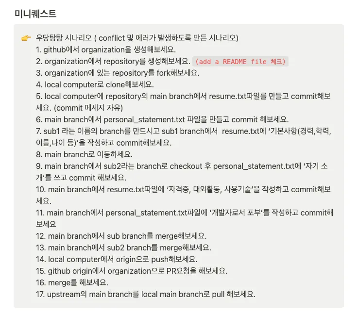

# TIL Template

## 날짜: 2025-01-29

### 스크럼
- 학습 목표 1 : Git 강의 보고 개념 정리 
- 학습 목표 2 : Git 실습 따라하기

### 새로 배운 내용
#### 주제 1: 주제에 대한 설명
- Git 기본 개념, 원격 저장소 관련, 변경 사항 관리, 기본 Git 명령어 정리 [참고 1]

#### 주제 2: 주제에 대한 설명
- 로컬 repository에 내 정보 기입하기
- Git PR 실습 진행 (우당탕탕 시나리오)

### 오늘의 도전 과제와 해결 방법
- Git PR 실습 진행 (우당탕탕 시나리오)

### 오늘의 회고
- Git에 대한 친밀도를 올리는 중이다. 아직 어색하지만 자주 쓰다보면 익숙해질듯하다.

### 참고 자료 및 링크
- [참고 1](Uhttps://www.notion.so/adapterz/Git-26bee236502c4d2582b38468883ab130)
